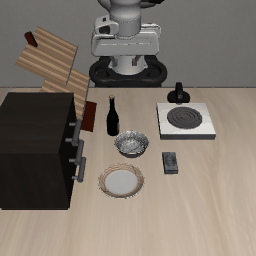

# From my hand to a simulated Panda: one demonstration, several uses

I filmed myself putting a bowl on a plate 21 times with an iPhone (RGB + LiDAR depth), extracted my hand and the
objects in 3D, and used these recordings to drive a Franka Panda in LIBERO (`libero_goal`, task
`put_the_bowl_on_the_plate`). The recordings are used three ways: **replayed** as trajectories, as the source of
data for an **imitation** policy, and as the reward of a **residual RL** policy.



*Imitation policy learned from a single recording (`a767851eec`), LIBERO initial state 40, never seen in training.*

## Results

All numbers below were measured by the scripts in this repository; the raw logs are in `results/*.txt`.
Success is LIBERO's own predicate (bowl on the plate, within 3 cm of its centre). Unless stated otherwise,
episodes are capped at **300 steps**, LeRobot's limit for `libero_goal`.

### Stage 1: replaying the retargeted hand trajectory

21 recordings x LIBERO initial states 0-9 (210 replays), open loop, success read at the end of the replay
(no step limit here).

| Retargeting version | Success |
|---|---|
| hand speed | 67/210 (31.9 %) |
| slowed down x2 | 81/210 (38.6 %) |
| slowed down x2, starts from the gripper's actual pose, 3 cm floor above the table, starts at the first hand motion | **110/210 (52.4 %)** |

Per recording, the last version ranges from 0/10 (6 recordings at 0 or 1) to 10/10 (5 recordings at 9 or 10).

### Stage 2: imitation

A 2 x 256 MLP maps the low-dimensional state (gripper pose and fingers, bowl relative to the gripper, plate relative
to the bowl) to a chunk of 10 actions and executes 5. Its data come from replaying a recording on LIBERO states
0-39 with Gaussian noise on the executed actions while the clean actions are recorded (DART-style), keeping
successful replays only.

| Training data | All 50 initial states | Held-out states 40-49 |
|---|---|---|
| **1 recording (`a767851eec`), 3 seeds** | **97.3 % +/- 3.8** (50, 46, 50 / 50) | **30/30** |
| 1 recording (`239e42a126`), seed 0 | | 0/10 |
| all 21 recordings, seed 0 | | 3/10 |
| all 21 recordings, near rim forced, seed 0 | | 2/10 |

States 0-39 provided the layouts used for data collection (not the evaluated episodes). For reference, the
published SmolVLA checkpoint scores 44/50 (88 %) on this task with the same 300-step limit; **this is not a fair
comparison**: my policy reads the simulator's exact object positions, SmolVLA reads camera images and a language
instruction.

What made the difference: **mixing the 21 recordings fails, one recording works.** My hand took the bowl from its
right, its front or its back depending on the take, lifted it more or less high, along different paths. A
regression policy averages these gestures, and the average of several valid gestures is not a valid gesture. One
recording replayed with noise over 40 layouts gives consistent data. Not every recording works:
`239e42a126` replays well (10/10) but its slowed-down gesture takes about 487 steps, beyond the 300-step limit.

### Generalisation beyond LIBERO's layouts

LIBERO places the bowl within a 3 x 3 cm region. With the bowl shifted (states 40-49, LIBERO's full scene):

| Bowl shift (x, y) | Imitation, LIBERO layouts | Imitation, widened layouts | Imitation + RL residual v1 |
|---|---|---|---|
| (0, 0) | 10/10 | 6/10 | 0/10 |
| (0, +5 cm) | 7/10 | 9/10 | 0/10 |
| (0, -5 cm) | 1/10 | 3/10 | 0/10 |
| (0, +10 cm) | 0/10 | 6/10 | 0/10 |
| (0, -10 cm) | 0/10 | 3/10 | 0/10 |
| (-5 cm, 0) | 3/10 | 7/10 | 0/10 |
| **total** | **21/60** | **34/60** | **0/60** |

"Widened layouts": the same recording and the same number of noisy replays (80), with the bowl drawn in
x from -15 to -8 cm and y from -10 to +10 cm (one seed). It generalises much better to shifted bowls and loses
in the original region, the same data now covering a much larger area.

### Stage 3: residual RL (negative result)

PPO learns a bounded residual (at most 30 % of the action range) on top of the frozen imitation policy, in a light
copy of the scene (table, bowl, plate) with the widened layouts. The reward follows the bowl path of the same
recording, retargeted to each layout.

- **Version 1** (reward: approach the demonstrated grasp point, stay close to the demonstrated bowl path at every
  step, progress along it, success; discount 0.99): training success fell from about 0.45 to 0 within 80,000
  steps; evaluated deterministically, **0/60**, and 0/10 even where imitation alone scores 10/10.
- **Version 2** (reward: progress along the demonstrated bowl path within 5 cm of it, plus success; discount
  0.995; learning rate 1e-4): the same decline, slower. Training success 0.79, 0.66, 0.46, 0.19 at 20k, 41k, 61k,
  82k steps; stopped there by a rule set in advance, so no evaluation.

The likely cause, not verified: starting from a good policy with an untrained critic, PPO's early updates drift
the residual and every drift degrades the base, which the success signal is too sparse to pull back. Known
remedies (penalising the residual's magnitude, warming up the critic first) were not tried within the time limit.
**On this task, replaying the demonstration over more layouts did far better than residual RL.**

## Pipeline

1. **Capture** (`h2r/capture.py`, `h2r/check_capture.py`): Stray Scanner recordings, RGB 1920 x 1440 at 30 fps,
   LiDAR depth 256 x 192 with confidence, intrinsics and ARKit odometry (the camera moved by at most 0.4 cm and
   1.5 degrees).
2. **Extraction** (`h2r/extract.py`, `h2r/hand.py`, `h2r/kalman.py`): MediaPipe hand landmarks lifted with the
   LiDAR depth at the palm, table plane by RANSAC + SVD, bowl and plate by colour and robust circle fits, pinch
   point smoothed by a constant-velocity Kalman filter with RTS smoothing. Grasp from the thumb-index aperture,
   release at the lowest pinch point over the plate.
3. **Retargeting** (`h2r/retarget.py`): object-centric. The approach is kept relative to the grasp point, placed on
   the simulated bowl's rim on the side the hand took; the carry is bent so the bowl ends over the plate centre
   (the real plate is 25 cm wide, the simulated one 13.7 cm); the gripper's yaw is set across the rim.
4. **Replay** (`h2r/replay.py`), **imitation** (`h2r/bc.py`), **residual RL** (`h2r/rl_residual.py`), **clip**
   (`h2r/clip.py`). The simulator is driven through LIBERO's operational-space controller in delta mode at 20 Hz
   (`h2r/sim.py`).

## Limitations

- The policies read the simulator's exact state, not images.
- **The "own layout" test is invalid.** Placing the simulated bowl where each recording had it (`replay --layout`)
  gave 12/63, but LIBERO's scene has a wine bottle where several recorded layouts put the bowl: 9 of 21 bowls were
  ejected 12 to 29 cm on placement. Kept in `results/stage1_replay_own_layout_INVALID.txt`, not counted.
- In the extraction frame used (`objects`), the bowl is on the bowl-plate axis by construction, so the lateral
  offsets I varied between takes are lost; `--frame=camera` keeps them but was not evaluated.
- The extracted plate diameter is 27 to 29 cm for 25 cm real (contour bias, the centre is unaffected); the bowl
  rim reads 15.5 to 16.6 cm when well seen, 11 to 13 cm on some takes.
- The simulator is not exactly repeatable between runs: the same policy varies by about 1/10.
- Widened-layout imitation: one seed only.

## Reproducing

Tested on WSL2 Ubuntu 24.04, Python 3.12. Versions: LeRobot 0.6.2 (commit `200ee53`), hf-libero 0.1.4,
robosuite 1.4.0, MuJoCo 3.8.1, MediaPipe 1.1.0, PyTorch 2.11.0, stable-baselines3 2.9.0, gymnasium 1.4.0.
The hand model goes in `models/`:
`https://storage.googleapis.com/mediapipe-models/hand_landmarker/hand_landmarker/float16/latest/hand_landmarker.task`.

```bash
source env.sh            # MuJoCo rendering setup (EGL; on WSL, the D3D12 driver)
python -m pytest -q      # 20 unit tests

# Stage 1: replay every processed recording on LIBERO states 0-9
python -m h2r.replay --demos data/processed/*.npz -n 10 --slowdown 2

# Stage 2: imitation from one recording (about 15 min), then the shifted-bowl evaluation
python -m h2r.bc --demos data/processed/a767851eec.npz --slowdown 2 --repeat 2 --seed 0 --out bc_a767851eec_seed0.pt
python -m h2r.rl_residual eval --base results/bc_a767851eec_seed0.pt --demos data/processed/a767851eec.npz --shifts

# Widened layouts: add --wide to the bc command (and --out bc_a767851eec_wide_seed0.pt)

# Stage 3: residual RL (about 70 min for 200k steps), then its evaluation
python -m h2r.rl_residual train --base results/bc_a767851eec_seed0.pt --demos data/processed/a767851eec.npz --wide --steps 200000
python -m h2r.rl_residual eval --base results/bc_a767851eec_seed0.pt --demos data/processed/a767851eec.npz --residual results/residual_seed0.zip --shifts
```

`data/processed/` holds the 21 extracted recordings (`.npz`) with a check image each. The raw RGB-D recordings
are not in the repository (size); `python -m h2r.extract data/raw/<take>` rebuilds a processed file from one.
Model checkpoints are not committed either: the commands above rebuild them.

## How this was built

Written with Claude Code (Anthropic) under my direction, in October 2026: I recorded the demonstrations, made the
design and stopping decisions, and reviewed the results; every number above comes from the scripts in this
repository, run on my machine.
